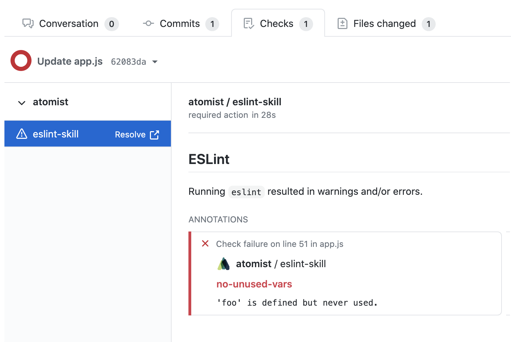
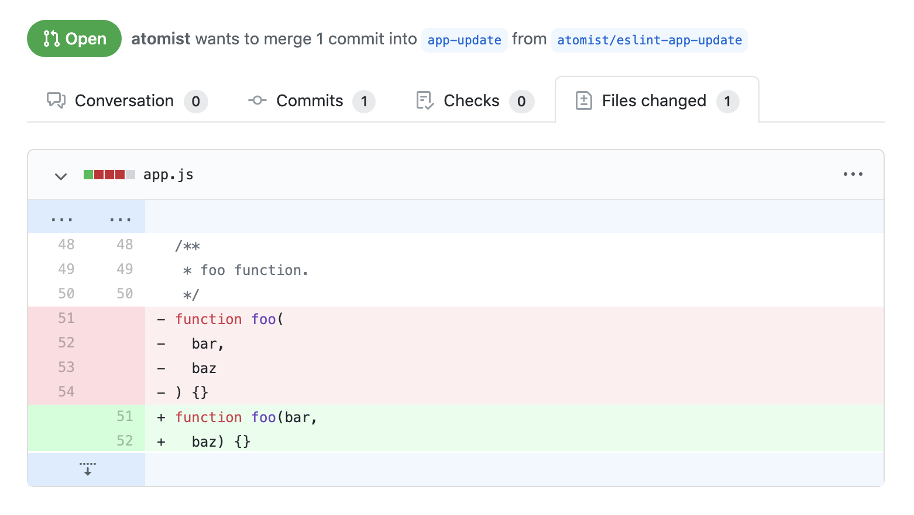
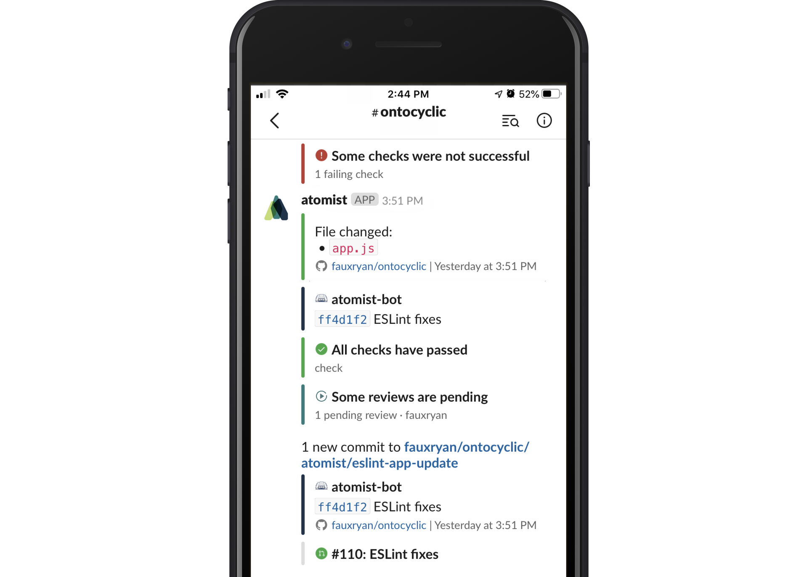
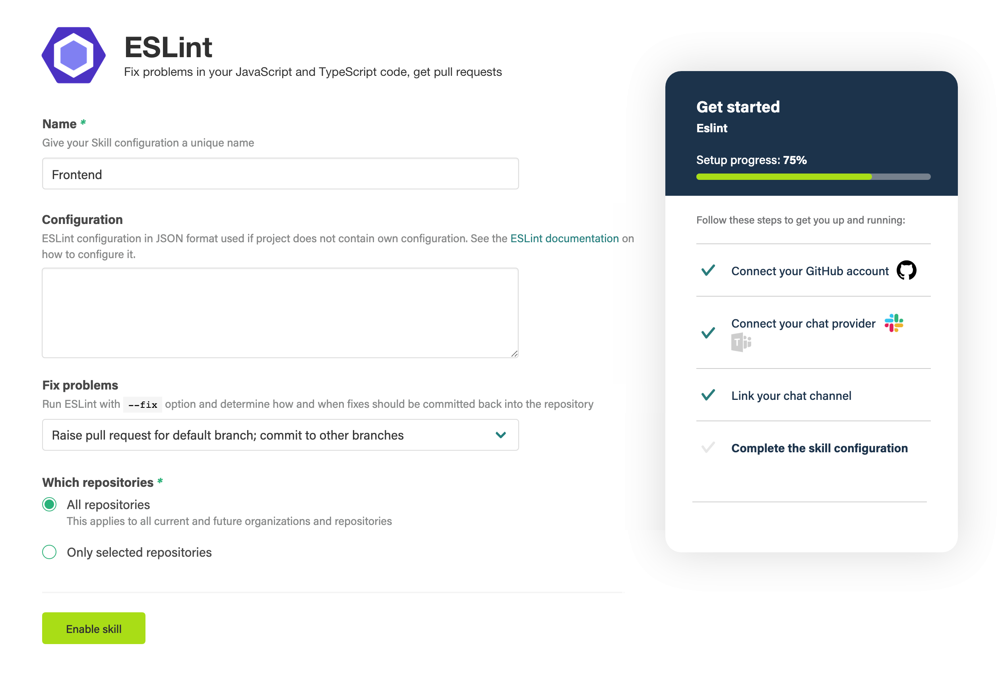

The ESLint skill runs `[eslint](https://eslint.org/)` on new pushes to your repositories. Use the linting configuration of your choice and apply it to as many repositories as you like in one quick step. Opt to get fixes as pull requests, branch commits, or simply as linting error checks.

Atomist runs the linting for you, so there's no need to set up an environment. It works alongside your continuous integration, and you get fine control over which branches get linted.

-   Runs automatically in the cloud, no need to run anything yourself
-   Get ESLint fixes as pull requests or commits
-   Adds GitHub Checks and code-level annotations for problems found
-   Use your chosen linting configuration across all of your projects
-   Get the same configuration for local linting, with optional Git commit hooks

# Automatically runs ESLint, adds check annotations

# New pull requests with fixes from ESLint

# Get notifications in Slack or Microsoft Teams

# Just turn it on — no need to run anything yourself

