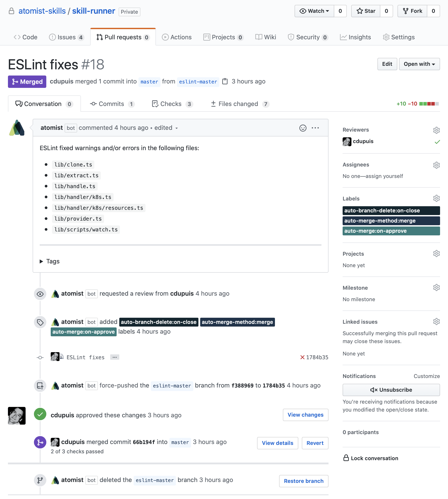
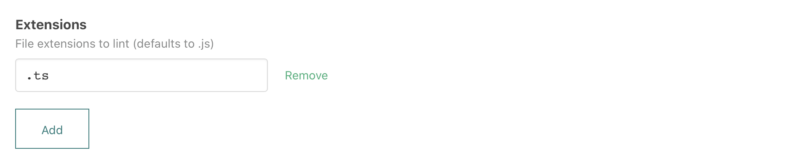
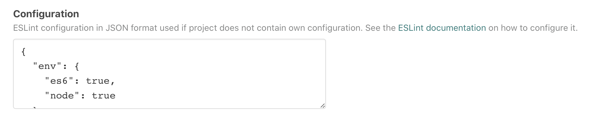
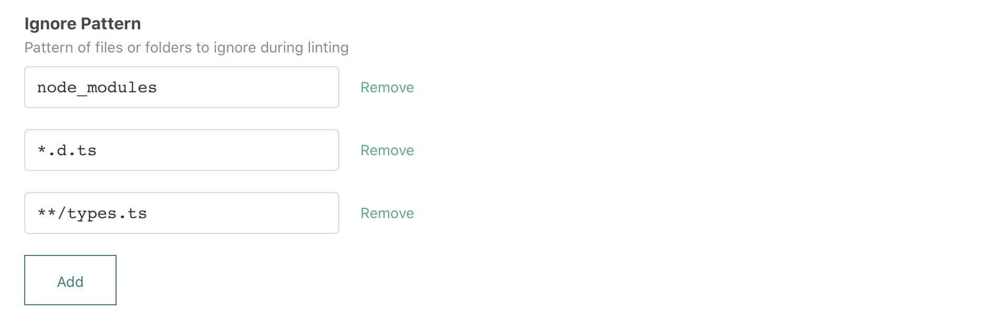
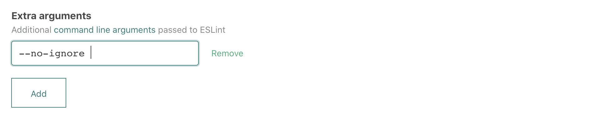
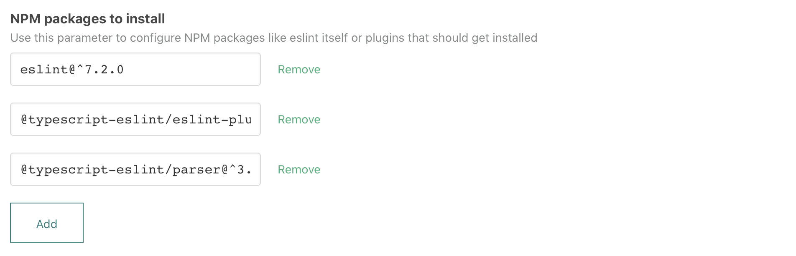
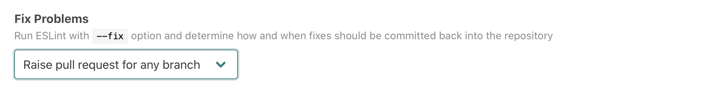

# `atomist/eslint-skill`
       
<!---atomist-skill-description:start--->

Find and fix problems in your JavaScript
code using ESLint every time new commits are pushed
to your repositories

<!---atomist-skill-description:end--->

---

<!---atomist-skill-long_description:start--->

# Find Problems
ESLint statically analyzes your code to quickly find problems. 
ESLint is built into most text editors and you can run ESLint
as part of your continuous integration pipeline.  This skill
will run every time new commits are pushed to your repositories.

# Fix Automatically
Many problems ESLint finds can be automatically fixed. ESLint
fixes are syntax-aware so you won't experience errors introduced
by traditional find-and-replace algorithms.  This skill can
optionally fix linting errors via pull request or direct commits.

<!---atomist-skill-long_description:end--->

---
       
<!---atomist-skill-readme:start---> 

# What it's useful for

With this skill you can automatically keep your JavaScript and TypeScript code
linted using ESLint.

The skill can be configured to run the same consistent ESLint configuration
across all your NPM projects, or use repository-specific configurations. It manages a 
GitHub Check with code-level annotations for linting rule violations and can
raise pull requests for automatic ESLint fixes. 

  

# Before you get started

Connect and configure these integrations:

1. **GitHub**
2. **Slack** 

The **GitHub** integration must be configured in order to use this skill. At
least one repository must be selected. The **Slack** integration is optional.

# How to configure

1. **Configure what files to lint**
    
    

    By default, ESLint lints every `.js` file in your project. If you are using,
    for example, TypeScript, you can use this parameter to configure what file types to
    lint.

1. **Specify an optional ESLint configuration in JSON format**

    

    This parameter lets you provide a [ESLint configuration](https://eslint.org/docs/user-guide/configuring)
    in JSON format that should be used for linting when the repository itself
    does not have its own configuration.
   
    Take a look at the ESLint configuration of the [GraphQL project](https://github.com/graphql/graphql-js/blob/master/.eslintrc.yml)
    in case you want to see a comprehensive example configuration.    

1. **Select files or folders to ignore during linting**

    

    To speed up linting you can ignore files and folders with 
    this parameter.

1. **Specify optional arguments to ESLint**

    

    Use this parameter to configure optional arguments passed to the `eslint`
    command. Review the [ESLint documentation](https://eslint.org/docs/2.13.1/user-guide/command-line-interface)
    for all available arguments. 

1. **Configure ESLint packages and plugins to be installed**

    

    If your ESLint configuration needs special packages or plugins, use
    this parameter to specify the NPM packages that should be installed in
    addition to dependencies from the `package.json`.
    
    Here's a configuration that provides ESLint itself and some TypeScript
    specific plugins:
    
    * `eslint@^7.2.0`
    * `@typescript-eslint/eslint-plugin@^3.2.0`
    * `@typescript-eslint/parser@^3.2.0`

1. **Specify if and how ESLint fixes should be pushed back into the repository** 

    

    ESLint can be executed with a `--fix` option. Use this parameter to configure
    how applied fixes should be pushed back into the repository. The following 
    options are available:
    
    * **Raise pull request for default branch; commit to other branches** - with this
    option, fixes on the default branch will be submitted via 
    a pull request; fixes on other branches will be committed straight 
    onto the branch
    * **Raise pull request for default branch only** - with this option, fixes on
    the default branch will be submitted via a pull
    request; fixes on other branches will not be persisted 
    * **Raise pull request for any branch** - with this option, fixes on
    all branches will be submitted via a pull request  
    * **Commit to default branch only** - with this option, fixes on the
    default branch will be committed straight to the branch; fixes on
    other branches will not be persisted
    * **Commit to any branch** - with this option, fixes on all branches will
    be committed straight to the branch
    * **Do not run --fix** 
    
    Pull requests that get raised by this skill will automatically have a reviewer
    assigned based on the person who pushed code. Pull requests that are not
    needed any longer, i.e., because all lint violations were fixed manually, are
    closed automatically.        

1. **Determine repository scope**
   
   
   
   By default, this skill will be enabled for all repositories in all
   organizations you have connected.
   
   To restrict the organizations or specific repositories on which the skill
   will run, you can explicitly choose organization(s) and repositories. 

# How to lint your JavaScript code

1. **Set up the skill by providing ESLint configuration, arguments and packages**

1. **Commit and push your code changes as normal and** 

1. **Enjoy not having to manually lint your code!**

To create feature requests or bug reports, create an [issue in the repository for this skill](https://github.com/atomist-skills/eslint-skill/issues). 
See the [code](https://github.com/atomist-skills/eslint-skill) for the skill.

<!---atomist-skill-readme:end--->

---

Created by [Atomist][atomist].
Need Help?  [Join our Slack workspace][slack].

[atomist]: https://atomist.com/ (Atomist - How Teams Deliver Software)
[slack]: https://join.atomist.com/ (Atomist Community Slack) 
