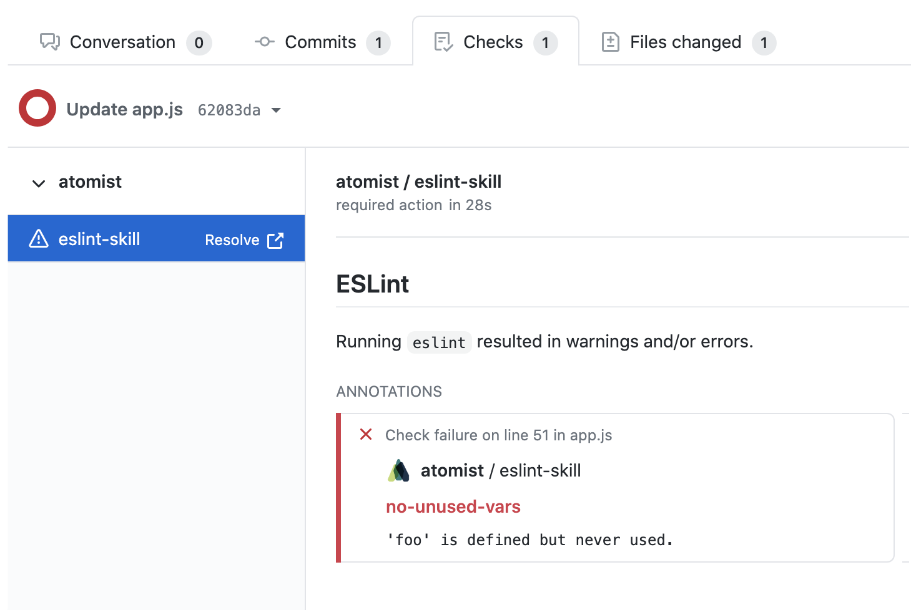
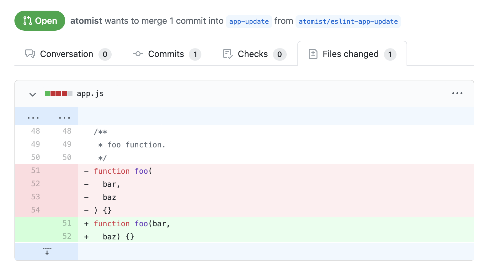
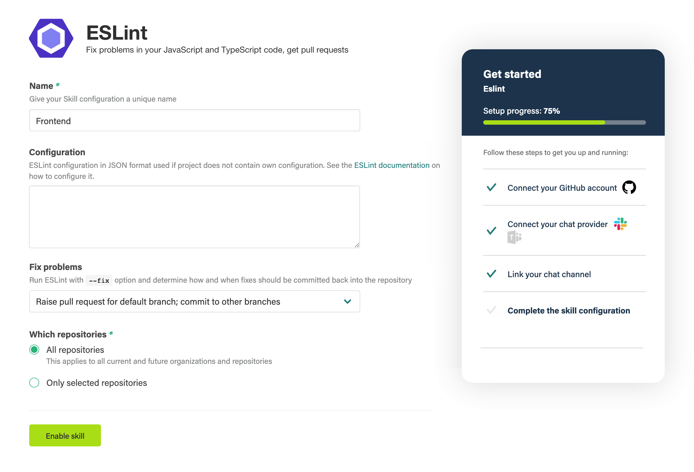

# `atomist/eslint-skill`

<!---atomist-skill-description:start--->

Fix problems in your JavaScript and TypeScript code, get pull requests

<!---atomist-skill-description:end--->

---

<!---atomist-skill-long_description:start--->

# Find Problems

ESLint statically analyzes your code to quickly find problems.
ESLint is built into most text editors and you can run ESLint
as part of your continuous integration pipeline. This skill
will run every time new commits are pushed to your repositories.

# Fix Automatically

Many problems ESLint finds can be automatically fixed. ESLint
fixes are syntax-aware so you won't experience errors introduced
by traditional find-and-replace algorithms. This skill can
optionally fix linting errors via pull request or direct commits.

<!---atomist-skill-long_description:end--->

---

<!---atomist-skill-readme:start--->

The ESLint skill runs `[eslint](https://eslint.org/)` on new pushes to your repositories. Use the linting configuration of your choice and apply it to as many repositories as you like in one quick step. Opt to get fixes as pull requests, branch commits, or simply as linting error checks.

Atomist runs the linting for you, so there's no need to set up an environment. It works alongside your continuous integration, and you get fine control over which branches get linted.

-   Runs automatically in the cloud, no need to run anything yourself
-   Get ESLint fixes as pull requests or commits
-   Adds GitHub Checks and code-level annotations for problems found
-   Use your chosen linting configuration across all of your projects
-   Get the same configuration for local linting, with optional Git commit hooks

# Automatically runs ESLint, adds check annotations

# New pull requests with fixes from ESLint

# Get notifications in Slack or Microsoft Teams

# Just turn it on — no need to run anything yourself

---

# Before you get started

Connect and configure these integrations:

1. **GitHub**
1. **Slack or Microsoft Teams**

The **GitHub** integration must be configured in order to use this skill. At
least one repository must be selected. The **Slack** or **Microsoft Teams**
integration is optional.

# How to configure

1. **Select which files to lint**

    

    By default, ESLint lints every `.js` file in your project. If you are
    using, for example, TypeScript, you can use this parameter to configure
    what file types to lint.

1. **Select files or folders to ignore**

    

    To speed up linting or avoid linting specific files, select which files
    and folders to ignore.

1. **Specify an optional ESLint configuration in JSON format**

    

    Provide the [ESLint configuration](https://eslint.org/docs/user-guide/configuring)
    in JSON format to be used for linting when a repository
    does not have its own configuration.

    For a comprehensive example, see the [GraphQL project's ESLint configuration](https://github.com/graphql/graphql-js/blob/master/.eslintrc.yml).

1. **Specify optional arguments to ESLint**

    

    Configure optional arguments to pass to the `eslint`
    command. See the [ESLint documentation](https://eslint.org/docs/2.13.1/user-guide/command-line-interface)
    for a list of available arguments.

1. **Configure ESLint packages and plugins to be installed**

    

    If your ESLint configuration needs special packages or plugins, use
    this parameter to specify the NPM packages that should be installed in
    addition to dependencies from the `package.json`.

    Here's a configuration that provides ESLint itself and some TypeScript
    specific plugins:

    - `eslint@^7.2.0`
    - `@typescript-eslint/eslint-plugin@^3.2.0`
    - `@typescript-eslint/parser@^3.2.0`

1. **Specify how to apply fixes**

    

    Choose which fix apply option to use or choose not to apply fixes.
    When a fix option is selected, ESLint will be run with the `--fix` option.
    The following options are available:

    - **Raise pull request for default branch; commit to other branches** - with this
      option, fixes on the default branch will be submitted via
      a pull request; fixes on other branches will be committed straight
      onto the branch
    - **Raise pull request for default branch only** - with this option, fixes on
      the default branch will be submitted via a pull
      request; fixes on other branches will not be persisted
    - **Raise pull request for any branch** - with this option, fixes on
      all branches will be submitted via a pull request
    - **Commit to default branch only** - with this option, fixes on the
      default branch will be committed straight to the branch; fixes on
      other branches will not be persisted
    - **Commit to any branch** - with this option, fixes on all branches will
      be committed straight to the branch
    - **Do not apply fixes**

    Pull requests that get raised by this skill will automatically have a reviewer
    assigned based on the person who pushed code. Pull requests that are not
    needed any longer, i.e., because all lint violations were fixed manually, are
    closed automatically.

1. **Configure pull request labels**

    Add additional labels to pull requests raised by this skill.

    This is useful to influence how and when the PR should be auto-merged by the
    [Auto-Merge Pull Requests](https://go.atomist.com/catalog/skills/atomist/github-auto-merge-skill)
    skill.

1. **Add ESLint configuration to repositories for local use**

    Choose one of these options to add the ESLint configuration to your repositories, and optionally
    enable [Git hooks](https://git-scm.com/book/en/v2/Customizing-Git-Git-Hooks) to get support for
    running ESLint locally with the same configuration.

    If you choose to install the Git commit hooks, ESLint will be run on each local commit you make.

    By default, the ESLint configuration will not be added to your repositories. Select one of these
    options to change the behavior:

    - **Update ESLint config, ignore files and install Git commit hooks** - the ESLint configuration
      will be added to the repository, ignore files updated to ignore the prettier configuration added,
      and the Git commit hook will be installed
    - **Update ESLint config and ignore files** - the same behavior as above, without installing the
      Git commit hook

1. **Determine repository scope**

    

    By default, this skill will be enabled for all repositories in all
    organizations you have connected.

    To restrict the organizations or specific repositories on which the skill
    will run, you can explicitly choose organization(s) and repositories.

# How to lint your JavaScript code

1. **Set up the skill by providing an ESLint configuration**

1. **Commit and push your code changes**

1. **Enjoy automatic linting and fixes!**

To create feature requests or bug reports, create an [issue in the repository for this skill](https://github.com/atomist-skills/eslint-skill/issues).
See the [code](https://github.com/atomist-skills/eslint-skill) for the skill.

<!---atomist-skill-readme:end--->

---

Created by [Atomist][atomist].
Need Help? [Join our Slack workspace][slack].

[atomist]: https://atomist.com/ "Atomist - How Teams Deliver Software"
[slack]: https://join.atomist.com/ "Atomist Community Slack"
